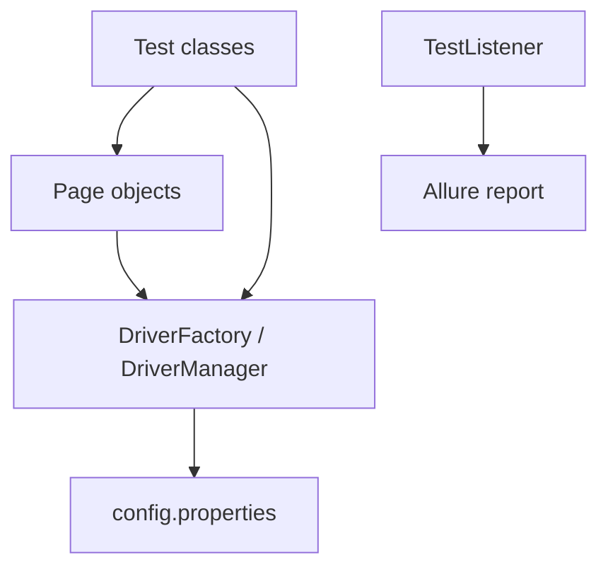

# Selenium SauceDemo Framework

[](https://github.com/Mata244/selenium-saucedemo-framework/actions/workflows/maven.yml)


Production-style UI test automation framework for [SauceDemo](https://www.saucedemo.com/), built with **Selenium 4**, **Java 21**, **Maven**, and **TestNG**. Designed as a portfolio project demonstrating maintainable test architecture, reporting, and CI.

## What this project demonstrates

- **Page Object Model** — locators and UI actions isolated from tests
- **ThreadLocal WebDriver** — safe driver lifecycle per test method
- **Config-driven execution** — browser, headless mode, URLs, and timeouts via properties
- **Allure reporting** — rich HTML reports with screenshots on failure
- **GitHub Actions CI** — headless Chrome runs on every push/PR

## Tech stack

| Tool | Version |
|------|---------|
| Java | 21 |
| Selenium | 4.41.0 |
| TestNG | 7.12.0 |
| WebDriverManager | 6.1.0 |
| Allure | 2.29.0 |
| Maven | 3.9+ |

## Project structure

```
src/test/java/com/automation/saucedemo/
├── config/          # ConfigReader, TestDataReader
├── driver/          # DriverFactory, DriverManager
├── listeners/       # TestListener (screenshots on failure)
├── pages/           # Page objects (Login, Inventory, Cart, Checkout)
└── tests/           # TestNG test classes
src/test/resources/
├── config.properties
├── testdata/users.properties
└── logback-test.xml
```

## Architecture



## Prerequisites

- JDK 21
- Maven 3.9+
- Chrome or Firefox (WebDriverManager downloads drivers automatically)

## Run tests locally

```bash
# Default: Chrome, headed mode
mvn clean test

# Headless (same as CI)
mvn clean test -Dheadless=true

# Firefox
mvn clean test -Dbrowser=firefox
```

## Allure report

```bash
mvn clean test
mvn allure:serve
```

Opens an interactive HTML report in your browser. Failed tests include screenshots attached by `TestListener`.

## Smoke test coverage

| Test | User story |
|------|------------|
| `validLoginShowsInventory` | Valid user reaches product inventory |
| `invalidLoginShowsError` | Invalid credentials show error message |
| `logoutReturnsToLoginPage` | User can log out successfully |
| `addOneProductUpdatesCartBadge` | Cart badge updates after adding one item |
| `addTwoProductsUpdatesCartBadge` | Cart badge shows correct count for two items |
| `cartShowsAddedProducts` | Cart page lists added products |
| `checkoutHappyPathCompletesOrder` | End-to-end checkout shows thank-you message |

## Configuration

Edit [`src/test/resources/config.properties`](src/test/resources/config.properties):

```properties
base.url=https://www.saucedemo.com/
browser=chrome
headless=false
explicit.wait=10
```

Override at runtime with system properties: `-Dheadless=true`, `-Dbrowser=firefox`.

Test users are in [`src/test/resources/testdata/users.properties`](src/test/resources/testdata/users.properties).

## Repository

**https://github.com/Mata244/selenium-saucedemo-framework**

If you are setting up locally for the first time, see [GITHUB_PUBLISH.md](GITHUB_PUBLISH.md).

## Roadmap

- Parallel execution via TestNG `parallel="methods"`
- Cross-browser matrix in CI (Chrome + Firefox)
- Selenium Grid / BrowserStack integration
- API layer validation (Rest Assured)
- Checkstyle / SpotBugs for code quality

## License

MIT — free to use and adapt for learning and portfolio purposes.
